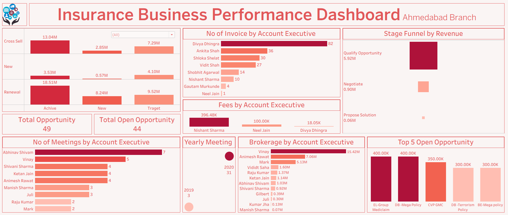

# Insurance Analytics Dashboard

## Dashboard Preview

## Project Overview
This project analyzes insurance business data using Power BI and Excel. The dashboard helps monitor revenue performance, budget achievement, policy sales, and key business KPIs.

## Tools Used
- Power BI
- Microsoft Excel
- SQL
- Tableau

## Key KPIs
- Revenue
- Budget vs Actual
- New Policies
- Renewals
- Cross-Sell Performance
- Sales Performance

## Dashboard Features
- Revenue Analysis
- Budget vs Actual Comparison
- Policy Sales Tracking
- Department-wise Performance
- KPI Monitoring
- Trend Analysis

## Business Insights
- Compared actual performance against budget targets.
- Identified high-performing and low-performing business areas.
- Analyzed policy sales trends.
- Supported business decision-making through KPI reporting.

## Outcome
The dashboard provides management with a clear view of business performance and helps track revenue growth opportunities.

## Author
Sonal Salvi
Operations Analyst | Reporting Analyst | MIS Analyst
